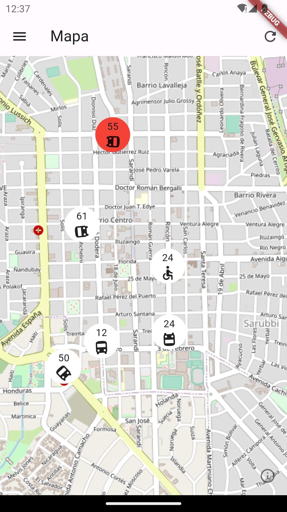
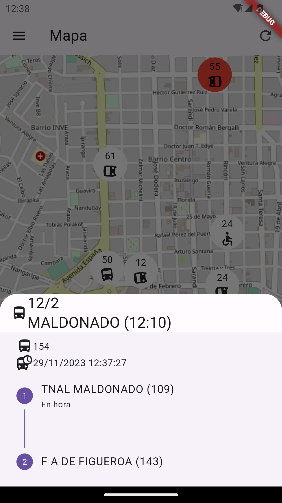
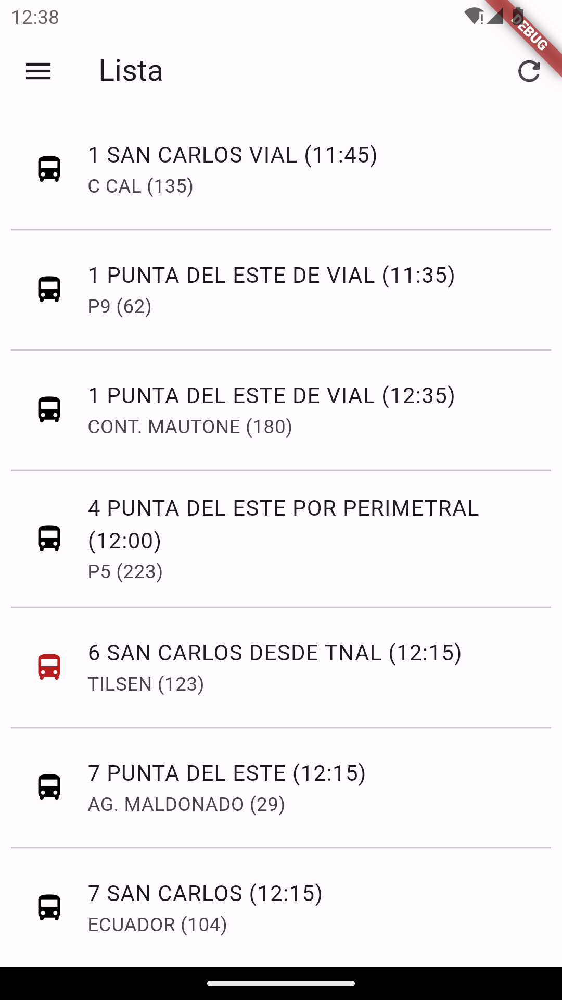
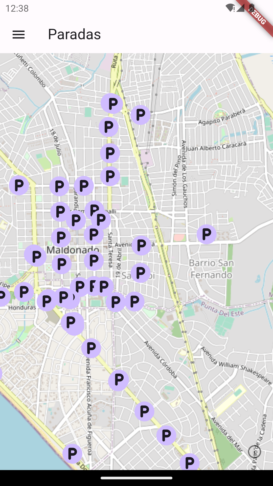
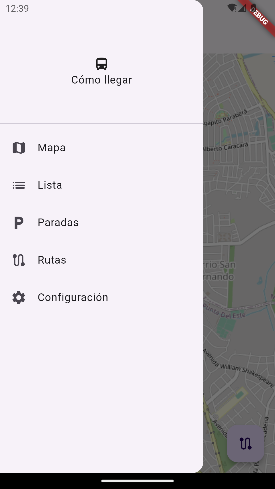

# como_llegar

Shows in realtime the location of buses.

For running this app a `lib/keys.dart` file is needed.

```dart
import 'package:como_llegar/src/models/map_provider.dart';

const String gtfsURL = "...";

const String busURL = "...";

const Map<String, MapProvider> maps = <String, MapProvider>{
  "OpenStreetMap": MapProvider(
    attribution: "OpenStreetMap contributors",
    url: "https://tile.openstreetmap.org/{z}/{x}/{y}.png",
  )
};
```

This is a template with the necessary properties. The `gtfsURL` property contains 
a string with the URL used by the `lib/src/persistence/persistence.dart` file for 
downloading the GTFS files.  The `maps` property describe the available map layers.









